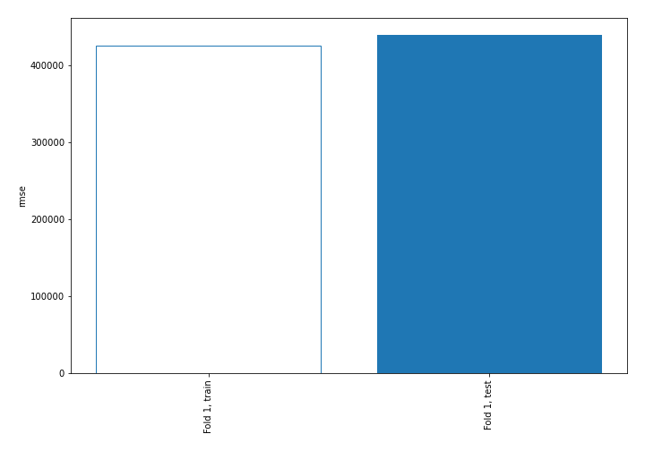
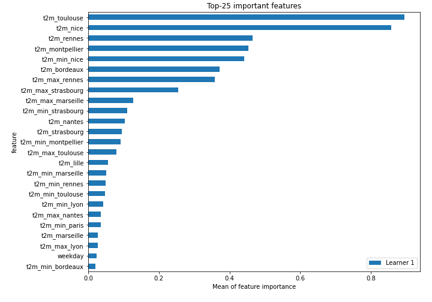
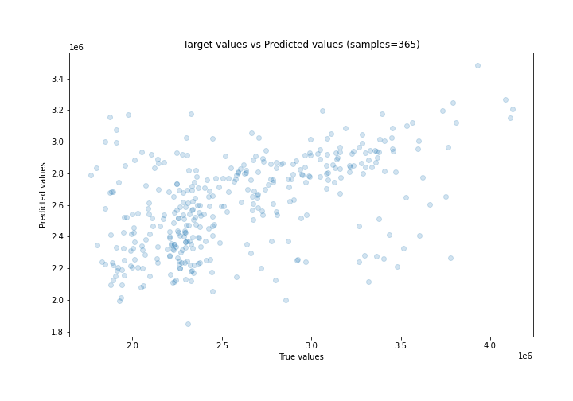
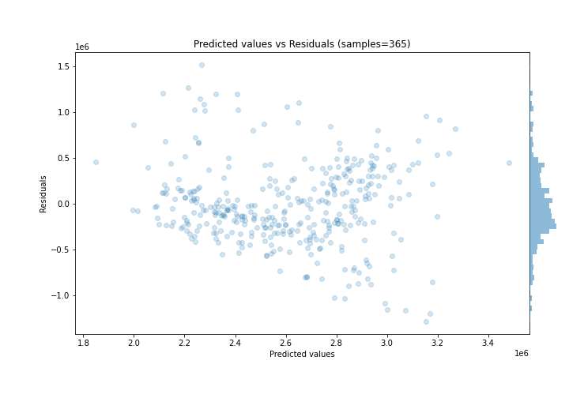
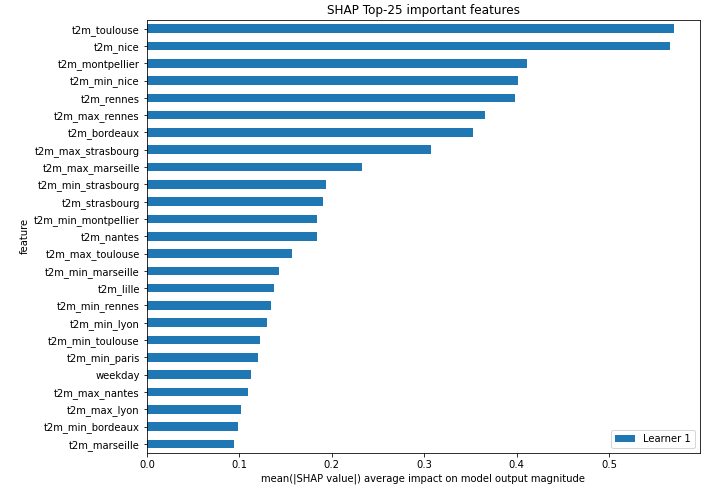
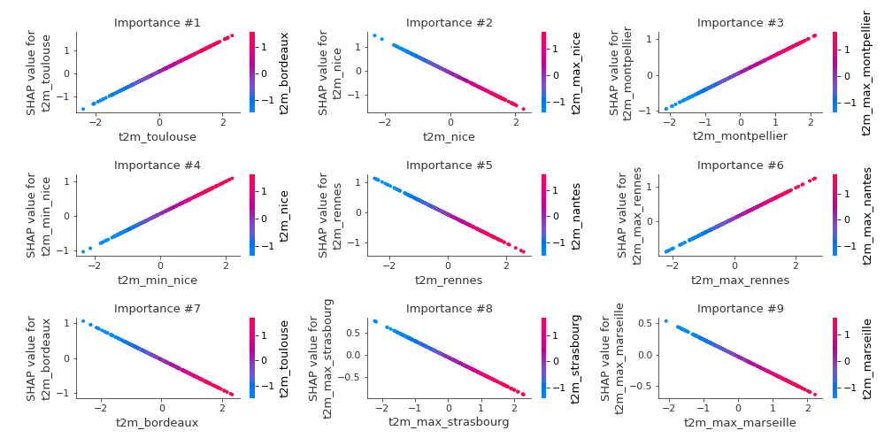
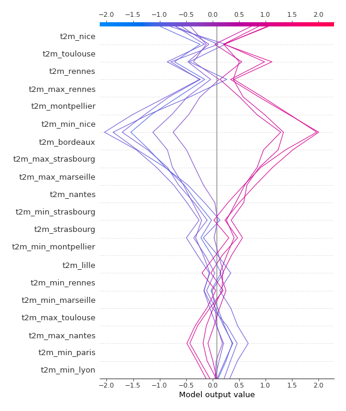
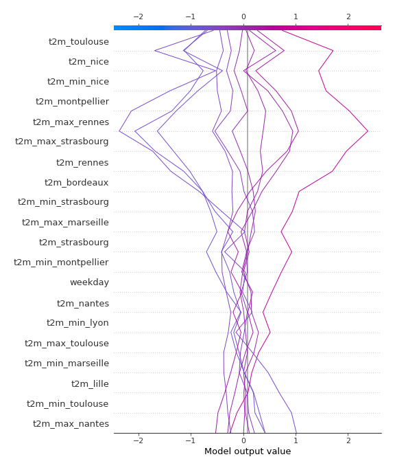

# Summary of 3_Linear

[<< Go back](../README.md)

## Linear Regression (Linear)
- **n_jobs**: -1
- **explain_level**: 2

## Validation
 - **validation_type**: split
 - **train_ratio**: 0.75
 - **shuffle**: True

## Optimized metric
rmse

## Training time

2.9 seconds

### Metric details:
| Metric   |            Score |
|:---------|-----------------:|
| MAE      | 334055           |
| MSE      |      1.93558e+11 |
| RMSE     | 439952           |
| R2       |      0.267219    |
| MAPE     |      0.13188     |

## Learning curves

## Coefficients
| feature             |    Learner_1 |
|:--------------------|-------------:|
| t2m_toulouse        |  0.690255    |
| t2m_montpellier     |  0.486844    |
| t2m_min_nice        |  0.467297    |
| t2m_max_rennes      |  0.438211    |
| t2m_strasbourg      |  0.223449    |
| t2m_min_rennes      |  0.163367    |
| t2m_min_lyon        |  0.152058    |
| t2m_min_paris       |  0.14586     |
| t2m_max_lyon        |  0.124586    |
| t2m_min_bordeaux    |  0.118921    |
| t2m_marseille       |  0.110031    |
| t2m_max_paris       |  0.0918123   |
| prectot_marseille   |  0.0868619   |
| t2m_max_bordeaux    |  0.0747497   |
| prectot_nantes      |  0.058522    |
| month               |  0.0565246   |
| t2m_min_nantes      |  0.0544439   |
| weighted_t2m_min    |  0.0477047   |
| prectot_lyon        |  0.0361473   |
| prectot_lille       |  0.0359109   |
| prectot_bordeaux    |  0.0134133   |
| t2m_max_nice        |  0.00914066  |
| weighted_prectot    |  0.000588689 |
| intercept           | -5.62951e-16 |
| prectot_strasbourg  | -0.00187988  |
| weighted_t2m        | -0.00682495  |
| weighted_t2m_max    | -0.0171499   |
| t2m_max_montpellier | -0.0201733   |
| prectot_rennes      | -0.0224381   |
| t2m_min_lille       | -0.0316099   |
| prectot_paris       | -0.0331421   |
| t2m_lyon            | -0.0491096   |
| prectot_nice        | -0.0533902   |
| prectot_toulouse    | -0.0536161   |
| t2m_max_lille       | -0.0560491   |
| prectot_montpellier | -0.0634829   |
| week_number         | -0.0744421   |
| t2m_paris           | -0.0784854   |
| weekday             | -0.129168    |
| t2m_max_nantes      | -0.132289    |
| t2m_min_toulouse    | -0.147999    |
| t2m_lille           | -0.163496    |
| t2m_min_marseille   | -0.165101    |
| t2m_max_toulouse    | -0.196256    |
| t2m_min_montpellier | -0.217235    |
| t2m_min_strasbourg  | -0.222982    |
| t2m_nantes          | -0.22366     |
| t2m_max_marseille   | -0.270627    |
| t2m_max_strasbourg  | -0.366276    |
| t2m_bordeaux        | -0.428473    |
| t2m_rennes          | -0.481725    |
| t2m_nice            | -0.663308    |

## Permutation-based Importance

## True vs Predicted

## Predicted vs Residuals

## SHAP Importance

## SHAP Dependence plots

### Dependence (Fold 1)

## SHAP Decision plots

### Top-10 Worst decisions (Fold 1)

### Top-10 Best decisions (Fold 1)

[<< Go back](../README.md)
