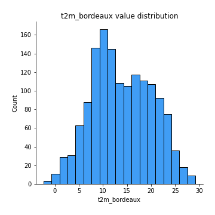
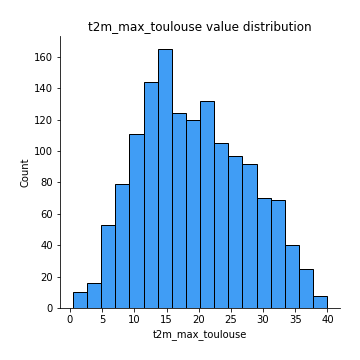

# Exploratory Data Analysis

[<< Go back](../README.md)
## Feature : target
- **Feature type** : continous
- **Missing** : 0.0%
- **Unique** : 1459
- **Count** :1460.0
- **Mean** :2615993.823972603
- **Std** :519679.2635455717
- **Min** :1760235.0
- **25%th Percentile** : 2242993.25
- **50%th Percentile** : 2446903.0
- **75%th Percentile** : 2999935.0
- **Max** :4176584.0

## Feature : weekday
- **Feature type** : discrete
- **Missing** : 0.0%
- **Unique** : 7
- **Count** :1460.0
- **Mean** :2.973972602739726
- **Std** :1.9905553140939125
- **Min** :0.0
- **25%th Percentile** : 1.0
- **50%th Percentile** : 3.0
- **75%th Percentile** : 5.0
- **Max** :6.0

## Feature : month
- **Feature type** : discrete
- **Missing** : 0.0%
- **Unique** : 12
- **Count** :1460.0
- **Mean** :6.515068493150685
- **Std** :3.489204784700323
- **Min** :1.0
- **25%th Percentile** : 3.0
- **50%th Percentile** : 6.5
- **75%th Percentile** : 10.0
- **Max** :12.0

## Feature : week_number
- **Feature type** : discrete
- **Missing** : 0.0%
- **Unique** : 53
- **Count** :1460.0
- **Mean** :26.588356164383562
- **Std** :15.221499217225942
- **Min** :1.0
- **25%th Percentile** : 13.0
- **50%th Percentile** : 26.0
- **75%th Percentile** : 40.0
- **Max** :53.0

## Feature : t2m_min_bordeaux
- **Feature type** : continous
- **Missing** : 0.0%
- **Unique** : 1052
- **Count** :1460.0
- **Mean** :9.695472602739716
- **Std** :5.470567053688251
- **Min** :-4.97
- **25%th Percentile** : 5.59
- **50%th Percentile** : 9.43
- **75%th Percentile** : 14.2125
- **Max** :21.84

## Feature : t2m_bordeaux
- **Feature type** : continous
- **Missing** : 0.0%
- **Unique** : 1079
- **Count** :1460.0
- **Mean** :13.905150684931508
- **Std** :6.185091311791186
- **Min** :-2.33
- **25%th Percentile** : 9.21
- **50%th Percentile** : 13.125
- **75%th Percentile** : 18.95
- **Max** :29.21

## Feature : t2m_max_bordeaux
- **Feature type** : continous
- **Missing** : 0.0%
- **Unique** : 1113
- **Count** :1460.0
- **Mean** :18.784513698630125
- **Std** :7.146973446236565
- **Min** :1.77
- **25%th Percentile** : 13.1875
- **50%th Percentile** : 18.23
- **75%th Percentile** : 24.1025
- **Max** :38.17

## Feature : prectot_bordeaux
- **Feature type** : continous
- **Missing** : 0.0%
- **Unique** : 502
- **Count** :1460.0
- **Mean** :2.200383561643843
- **Std** :3.8556270073417696
- **Min** :0.0
- **25%th Percentile** : 0.03
- **50%th Percentile** : 0.32
- **75%th Percentile** : 2.6425
- **Max** :31.59

## Feature : t2m_min_lille
- **Feature type** : continous
- **Missing** : 0.0%
- **Unique** : 1058
- **Count** :1460.0
- **Mean** :6.59787671232877
- **Std** :5.386580335993567
- **Min** :-7.69
- **25%th Percentile** : 2.4525
- **50%th Percentile** : 6.63
- **75%th Percentile** : 11.0
- **Max** :19.85

## Feature : t2m_lille
- **Feature type** : continous
- **Missing** : 0.0%
- **Unique** : 1087
- **Count** :1460.0
- **Mean** :10.5591095890411
- **Std** :6.210033107894164
- **Min** :-4.4
- **25%th Percentile** : 5.8
- **50%th Percentile** : 10.23
- **75%th Percentile** : 15.862499999999999
- **Max** :28.1

## Feature : t2m_max_lille
- **Feature type** : continous
- **Missing** : 0.0%
- **Unique** : 1119
- **Count** :1460.0
- **Mean** :14.837445205479456
- **Std** :6.995105209756044
- **Min** :-0.77
- **25%th Percentile** : 9.2775
- **50%th Percentile** : 14.61
- **75%th Percentile** : 20.53
- **Max** :36.19

## Feature : prectot_lille
- **Feature type** : continous
- **Missing** : 0.0%
- **Unique** : 507
- **Count** :1460.0
- **Mean** :1.9601712328767136
- **Std** :3.315152788396411
- **Min** :0.0
- **25%th Percentile** : 0.05
- **50%th Percentile** : 0.48
- **75%th Percentile** : 2.5324999999999998
- **Max** :31.12

## Feature : t2m_min_paris
- **Feature type** : continous
- **Missing** : 0.0%
- **Unique** : 1054
- **Count** :1460.0
- **Mean** :6.6402397260273895
- **Std** :5.738391722309275
- **Min** :-8.68
- **25%th Percentile** : 2.4075
- **50%th Percentile** : 6.425
- **75%th Percentile** : 11.13
- **Max** :22.25

## Feature : t2m_paris
- **Feature type** : continous
- **Missing** : 0.0%
- **Unique** : 1102
- **Count** :1460.0
- **Mean** :11.10974657534247
- **Std** :6.739209414110303
- **Min** :-5.38
- **25%th Percentile** : 5.95
- **50%th Percentile** : 10.535
- **75%th Percentile** : 16.64
- **Max** :30.74

## Feature : t2m_max_paris
- **Feature type** : continous
- **Missing** : 0.0%
- **Unique** : 1146
- **Count** :1460.0
- **Mean** :15.919999999999993
- **Std** :7.58885873062923
- **Min** :-1.76
- **25%th Percentile** : 9.9875
- **50%th Percentile** : 15.685
- **75%th Percentile** : 21.9225
- **Max** :39.67

## Feature : prectot_paris
- **Feature type** : continous
- **Missing** : 0.0%
- **Unique** : 477
- **Count** :1460.0
- **Mean** :1.8740684931506868
- **Std** :3.48199288587236
- **Min** :0.0
- **25%th Percentile** : 0.04
- **50%th Percentile** : 0.39
- **75%th Percentile** : 2.1
- **Max** :42.02

## Feature : t2m_min_rennes
- **Feature type** : continous
- **Missing** : 0.0%
- **Unique** : 1003
- **Count** :1460.0
- **Mean** :7.858205479452043
- **Std** :4.813057583543534
- **Min** :-6.2
- **25%th Percentile** : 4.4525
- **50%th Percentile** : 7.82
- **75%th Percentile** : 11.61
- **Max** :20.27

## Feature : t2m_rennes
- **Feature type** : continous
- **Missing** : 0.0%
- **Unique** : 1044
- **Count** :1460.0
- **Mean** :11.721493150684942
- **Std** :5.487954804872499
- **Min** :-2.92
- **25%th Percentile** : 7.6675
- **50%th Percentile** : 11.395
- **75%th Percentile** : 16.0
- **Max** :26.3

## Feature : t2m_max_rennes
- **Feature type** : continous
- **Missing** : 0.0%
- **Unique** : 1075
- **Count** :1460.0
- **Mean** :15.993027397260267
- **Std** :6.224178419453661
- **Min** :0.11
- **25%th Percentile** : 11.09
- **50%th Percentile** : 15.67
- **75%th Percentile** : 20.785
- **Max** :33.22

## Feature : prectot_rennes
- **Feature type** : continous
- **Missing** : 0.0%
- **Unique** : 501
- **Count** :1460.0
- **Mean** :2.0458287671232886
- **Std** :3.4416910201624944
- **Min** :0.0
- **25%th Percentile** : 0.07
- **50%th Percentile** : 0.52
- **75%th Percentile** : 2.5549999999999997
- **Max** :26.74

## Feature : t2m_min_nantes
- **Feature type** : continous
- **Missing** : 0.0%
- **Unique** : 1017
- **Count** :1460.0
- **Mean** :7.751431506849304
- **Std** :5.332242770135718
- **Min** :-6.45
- **25%th Percentile** : 3.8825000000000003
- **50%th Percentile** : 7.75
- **75%th Percentile** : 11.905000000000001
- **Max** :21.32

## Feature : t2m_nantes
- **Feature type** : continous
- **Missing** : 0.0%
- **Unique** : 1079
- **Count** :1460.0
- **Mean** :12.113479452054802
- **Std** :6.00682386257151
- **Min** :-3.46
- **25%th Percentile** : 7.61
- **50%th Percentile** : 11.695
- **75%th Percentile** : 16.845
- **Max** :27.79

## Feature : t2m_max_nantes
- **Feature type** : continous
- **Missing** : 0.0%
- **Unique** : 1107
- **Count** :1460.0
- **Mean** :16.91666438356163
- **Std** :6.7120973237567965
- **Min** :-0.36
- **25%th Percentile** : 11.844999999999999
- **50%th Percentile** : 16.479999999999997
- **75%th Percentile** : 22.134999999999998
- **Max** :34.85

## Feature : prectot_nantes
- **Feature type** : continous
- **Missing** : 0.0%
- **Unique** : 487
- **Count** :1460.0
- **Mean** :2.0829315068493193
- **Std** :3.902122166781794
- **Min** :0.0
- **25%th Percentile** : 0.05
- **50%th Percentile** : 0.34
- **75%th Percentile** : 2.245
- **Max** :41.12

## Feature : t2m_min_toulouse
- **Feature type** : continous
- **Missing** : 0.0%
- **Unique** : 1096
- **Count** :1460.0
- **Mean** :8.810109589041103
- **Std** :6.141574634187603
- **Min** :-6.59
- **25%th Percentile** : 4.2825
- **50%th Percentile** : 8.17
- **75%th Percentile** : 13.78
- **Max** :22.49

## Feature : t2m_toulouse
- **Feature type** : continous
- **Missing** : 0.0%
- **Unique** : 1116
- **Count** :1460.0
- **Mean** :13.667054794520512
- **Std** :7.177442107944643
- **Min** :-3.64
- **25%th Percentile** : 8.05
- **50%th Percentile** : 12.825
- **75%th Percentile** : 19.2925
- **Max** :30.84

## Feature : t2m_max_toulouse
- **Feature type** : continous
- **Missing** : 0.0%
- **Unique** : 1157
- **Count** :1460.0
- **Mean** :19.243068493150698
- **Std** :8.210431179895595
- **Min** :0.45
- **25%th Percentile** : 12.9375
- **50%th Percentile** : 18.61
- **75%th Percentile** : 25.4625
- **Max** :39.97

## Feature : prectot_toulouse
- **Feature type** : continous
- **Missing** : 0.0%
- **Unique** : 518
- **Count** :1460.0
- **Mean** :2.202458904109595
- **Std** :3.988274492652396
- **Min** :0.0
- **25%th Percentile** : 0.03
- **50%th Percentile** : 0.345
- **75%th Percentile** : 2.525
- **Max** :31.28

## Feature : t2m_min_marseille
- **Feature type** : continous
- **Missing** : 0.0%
- **Unique** : 1033
- **Count** :1460.0
- **Mean** :13.213041095890404
- **Std** :5.689293005192018
- **Min** :-0.02
- **25%th Percentile** : 8.57
- **50%th Percentile** : 12.434999999999999
- **75%th Percentile** : 18.15
- **Max** :26.39

## Feature : t2m_marseille
- **Feature type** : continous
- **Missing** : 0.0%
- **Unique** : 1043
- **Count** :1460.0
- **Mean** :15.887541095890425
- **Std** :5.960301917946234
- **Min** :1.77
- **25%th Percentile** : 11.1075
- **50%th Percentile** : 15.05
- **75%th Percentile** : 21.0225
- **Max** :28.87

## Feature : t2m_max_marseille
- **Feature type** : continous
- **Missing** : 0.0%
- **Unique** : 1052
- **Count** :1460.0
- **Mean** :18.735479452054808
- **Std** :6.23391268939844
- **Min** :3.63
- **25%th Percentile** : 13.66
- **50%th Percentile** : 17.935000000000002
- **75%th Percentile** : 24.134999999999998
- **Max** :33.5

## Feature : prectot_marseille
- **Feature type** : continous
- **Missing** : 0.0%
- **Unique** : 358
- **Count** :1460.0
- **Mean** :1.7083904109589023
- **Std** :5.354827862555897
- **Min** :0.0
- **25%th Percentile** : 0.0
- **50%th Percentile** : 0.05
- **75%th Percentile** : 0.63
- **Max** :87.48

## Feature : t2m_min_lyon
- **Feature type** : continous
- **Missing** : 0.0%
- **Unique** : 1098
- **Count** :1460.0
- **Mean** :6.456602739726021
- **Std** :6.6640022259888445
- **Min** :-11.18
- **25%th Percentile** : 1.1025
- **50%th Percentile** : 5.9399999999999995
- **75%th Percentile** : 11.772499999999999
- **Max** :22.14

## Feature : t2m_lyon
- **Feature type** : continous
- **Missing** : 0.0%
- **Unique** : 1132
- **Count** :1460.0
- **Mean** :11.182863013698634
- **Std** :7.847717393502481
- **Min** :-7.95
- **25%th Percentile** : 5.047499999999999
- **50%th Percentile** : 10.175
- **75%th Percentile** : 17.47
- **Max** :29.65

## Feature : t2m_max_lyon
- **Feature type** : continous
- **Missing** : 0.0%
- **Unique** : 1188
- **Count** :1460.0
- **Mean** :16.467513698630153
- **Std** :8.916451578728482
- **Min** :-4.5
- **25%th Percentile** : 9.34
- **50%th Percentile** : 15.735
- **75%th Percentile** : 23.314999999999998
- **Max** :37.8

## Feature : prectot_lyon
- **Feature type** : continous
- **Missing** : 0.0%
- **Unique** : 474
- **Count** :1460.0
- **Mean** :2.0143287671232932
- **Std** :3.966094033113799
- **Min** :0.0
- **25%th Percentile** : 0.02
- **50%th Percentile** : 0.305
- **75%th Percentile** : 2.2525
- **Max** :36.91

## Feature : t2m_min_nice
- **Feature type** : continous
- **Missing** : 0.0%
- **Unique** : 1045
- **Count** :1460.0
- **Mean** :10.565589041095885
- **Std** :6.040861705040714
- **Min** :-4.16
- **25%th Percentile** : 5.54
- **50%th Percentile** : 9.63
- **75%th Percentile** : 15.6025
- **Max** :24.54

## Feature : t2m_nice
- **Feature type** : continous
- **Missing** : 0.0%
- **Unique** : 1065
- **Count** :1460.0
- **Mean** :13.527342465753412
- **Std** :6.588531184760483
- **Min** :-2.57
- **25%th Percentile** : 7.9475
- **50%th Percentile** : 12.6
- **75%th Percentile** : 19.155
- **Max** :28.83

## Feature : t2m_max_nice
- **Feature type** : continous
- **Missing** : 0.0%
- **Unique** : 1104
- **Count** :1460.0
- **Mean** :16.937863013698603
- **Std** :7.039263259231326
- **Min** :-0.86
- **25%th Percentile** : 11.06
- **50%th Percentile** : 16.06
- **75%th Percentile** : 22.89
- **Max** :33.05

## Feature : prectot_nice
- **Feature type** : continous
- **Missing** : 0.0%
- **Unique** : 420
- **Count** :1460.0
- **Mean** :2.32798630136987
- **Std** :6.699676282407345
- **Min** :0.0
- **25%th Percentile** : 0.01
- **50%th Percentile** : 0.14
- **75%th Percentile** : 1.3
- **Max** :75.9

## Feature : t2m_min_strasbourg
- **Feature type** : continous
- **Missing** : 0.0%
- **Unique** : 1107
- **Count** :1460.0
- **Mean** :5.9825821917808195
- **Std** :6.799811611163803
- **Min** :-11.89
- **25%th Percentile** : 0.505
- **50%th Percentile** : 5.535
- **75%th Percentile** : 11.465
- **Max** :23.54

## Feature : t2m_strasbourg
- **Feature type** : continous
- **Missing** : 0.0%
- **Unique** : 1139
- **Count** :1460.0
- **Mean** :10.414342465753434
- **Std** :7.9665368620377635
- **Min** :-8.53
- **25%th Percentile** : 4.0375
- **50%th Percentile** : 9.77
- **75%th Percentile** : 16.895
- **Max** :29.55

## Feature : t2m_max_strasbourg
- **Feature type** : continous
- **Missing** : 0.0%
- **Unique** : 1177
- **Count** :1460.0
- **Mean** :15.286164383561633
- **Std** :8.981279354033807
- **Min** :-5.89
- **25%th Percentile** : 7.7775
- **50%th Percentile** : 15.05
- **75%th Percentile** : 22.47
- **Max** :37.03

## Feature : prectot_strasbourg
- **Feature type** : continous
- **Missing** : 0.0%
- **Unique** : 515
- **Count** :1460.0
- **Mean** :2.176082191780822
- **Std** :3.6290930323212502
- **Min** :0.0
- **25%th Percentile** : 0.04
- **50%th Percentile** : 0.42
- **75%th Percentile** : 2.8725
- **Max** :39.2

## Feature : t2m_min_montpellier
- **Feature type** : continous
- **Missing** : 0.0%
- **Unique** : 1072
- **Count** :1460.0
- **Mean** :9.4643698630137
- **Std** :6.283914085224471
- **Min** :-7.25
- **25%th Percentile** : 4.3
- **50%th Percentile** : 8.77
- **75%th Percentile** : 14.772499999999999
- **Max** :24.56

## Feature : t2m_montpellier
- **Feature type** : continous
- **Missing** : 0.0%
- **Unique** : 1102
- **Count** :1460.0
- **Mean** :13.864143835616424
- **Std** :7.103424365577065
- **Min** :-3.79
- **25%th Percentile** : 8.184999999999999
- **50%th Percentile** : 13.05
- **75%th Percentile** : 19.5425
- **Max** :31.6

## Feature : t2m_max_montpellier
- **Feature type** : continous
- **Missing** : 0.0%
- **Unique** : 1126
- **Count** :1460.0
- **Mean** :18.91946575342463
- **Std** :7.945314575485267
- **Min** :1.09
- **25%th Percentile** : 12.385
- **50%th Percentile** : 17.765
- **75%th Percentile** : 25.385
- **Max** :40.9

## Feature : prectot_montpellier
- **Feature type** : continous
- **Missing** : 0.0%
- **Unique** : 423
- **Count** :1460.0
- **Mean** :2.0704452054794573
- **Std** :5.3320199626265685
- **Min** :0.0
- **25%th Percentile** : 0.01
- **50%th Percentile** : 0.12
- **75%th Percentile** : 1.31
- **Max** :71.24

## Feature : weighted_t2m
- **Feature type** : continous
- **Missing** : 0.0%
- **Unique** : 1460
- **Count** :1460.0
- **Mean** :12.428515955518467
- **Std** :6.556742933241863
- **Min** :-3.568716592500619
- **25%th Percentile** : 7.080428727522411
- **50%th Percentile** : 11.71716994605696
- **75%th Percentile** : 17.9440239306385
- **Max** :29.098955839592893

## Feature : weighted_t2m_min
- **Feature type** : continous
- **Missing** : 0.0%
- **Unique** : 1460
- **Count** :1460.0
- **Mean** :8.31528822236834
- **Std** :5.6583110649577995
- **Min** :-5.998476400064738
- **25%th Percentile** : 3.8690998291199574
- **50%th Percentile** : 7.865980917587917
- **75%th Percentile** : 13.013637228733568
- **Max** :22.456122775081205

## Feature : weighted_t2m_max
- **Feature type** : continous
- **Missing** : 0.0%
- **Unique** : 1460
- **Count** :1460.0
- **Mean** :16.954893984406006
- **Std** :7.272000301212933
- **Min** :-0.6203747151651319
- **25%th Percentile** : 11.028108871431765
- **50%th Percentile** : 16.3663044664479
- **75%th Percentile** : 22.96077129307138
- **Max** :36.15823646484249

## Feature : weighted_prectot
- **Feature type** : continous
- **Missing** : 0.0%
- **Unique** : 1458
- **Count** :1460.0
- **Mean** :1.9731972999373117
- **Std** :2.735942561863112
- **Min** :0.0
- **25%th Percentile** : 0.18329612713101073
- **50%th Percentile** : 0.840118712442008
- **75%th Percentile** : 2.7213186332402524
- **Max** :23.14490405513992

[<< Go back](../README.md)
